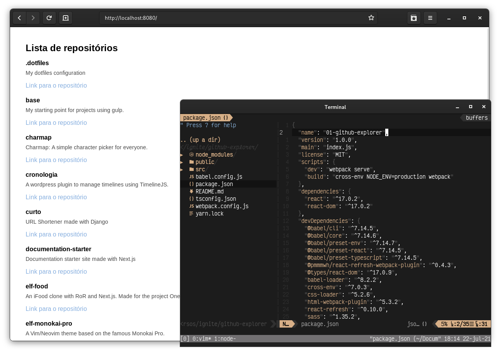

<h1 align="center">Github Explorer</h1>

#### Ignite

## Sobre o projeto

O **github-explorer** é uma lista dos repositórios. O objetivo deste projeto foi recriar um CRA (Create React App) do zero, ou seja, configurar as ferramentas Babel, Webpack e loaders e TypeScript para servir uma aplicação React.

---

## Tecnologias utilizadas

Esse projeto foi desenvolvido utilizando as seguintes tecnologias abaixo:

- React
- Babel
- Webpack
- TypeScript

---

## Como contribuir

- Crie um fork deste repositório
- Faça uma branch com a sua feature: `git checkout -b minha-feature`;
- Envie suas alterações: `git commit -m 'feat: Minha nova feature'`;
- Faça um push para a sua branch: `git push origin minha-feature`.
